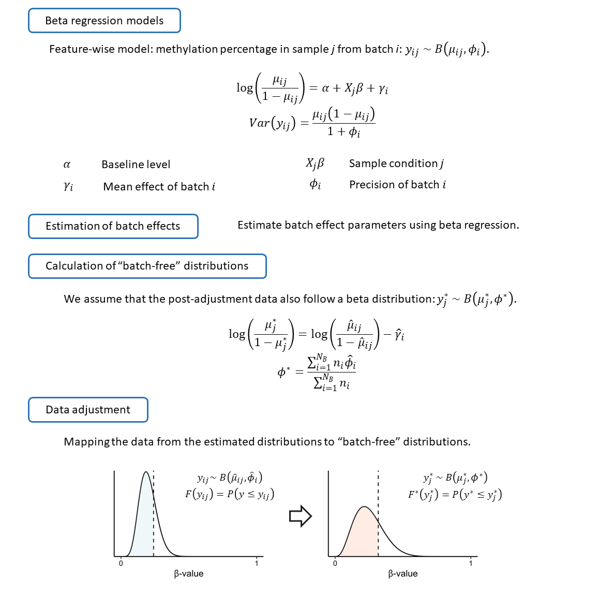
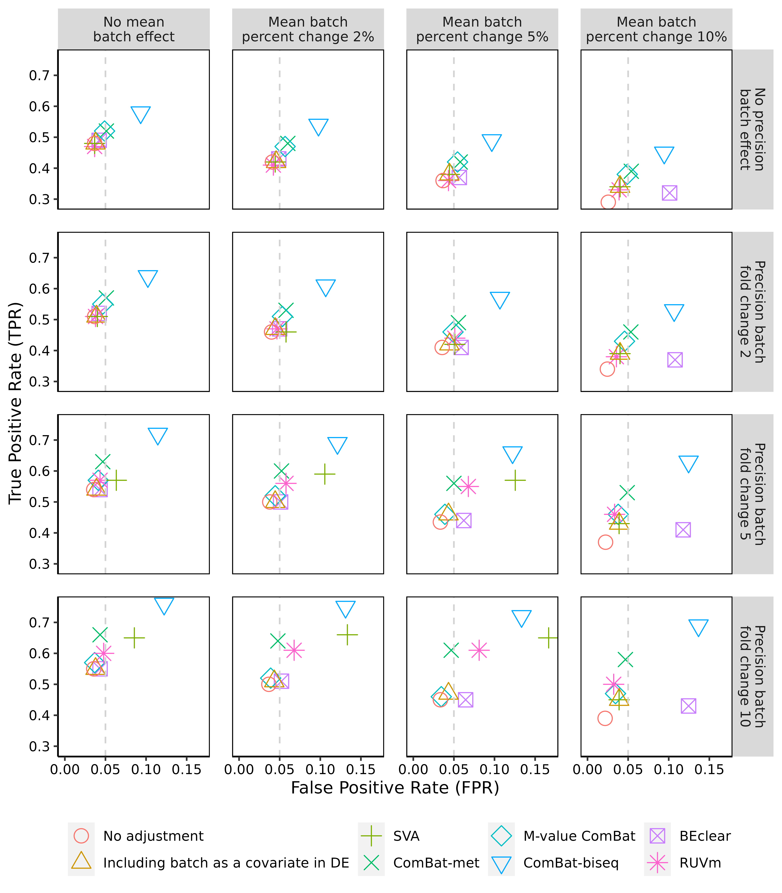
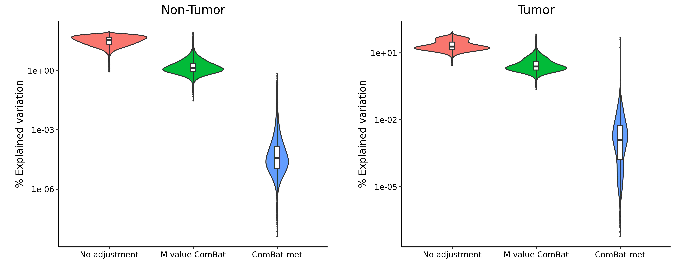
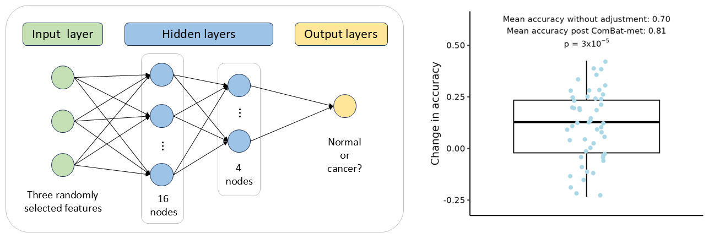

ComBatMet
================
Junmin Wang
03/31/2025

This page aims to present ComBat-met in an accessible way for a broad 
audience. For those interested in implementing ComBat-met or reproducing 
the results in the manuscript, detailed prerequisites and code descriptions are 
provided at the bottom of this page.

## Introduction

Integration of genomics data is frequently impeded by technical artifacts, commonly 
referred to as batch effects. While many batch correction methods are available, they 
often fail to adequately account for the unique properties of DNA methylation data. 

To  address this limitation, we developed **ComBat-met**, a novel batch adjustment framework 
specifically tailored for methylation studies. This method employs a beta regression model 
to estimate batch-free distributions, and realigns quantiles of the data to their corrected 
counterparts, providing robust adjustment for technical variations (see Fig. 1 for details of 
the workflow).

<div align="center">
  
</div>

**Fig. 1.** Overview of the ComBat-met workflow.

## Benchmarking

We compared ComBat-met to existing batch adjustment methods using simulated methylation 
datasets with known ground truth. Each method was applied under identical conditions, and 
their ability to remove batch effects while preserving biological variability was assessed. 
Below is a description of the methods included in the comparison besides ComBat-met: 

- **M-value ComBat**: Beta values are log-transformed into M-values, and batch correction 
is performed using ComBat.
- **SVA (Surrogate Variable Analysis)**: Beta values are log-transformed into M-values, 
followed by batch correction using SVA.
- **Including Batch as a Covariate in DE**: Batch is explicitly included as a covariate 
during differential expression analysis to account for technical variation.
- **ComBat-biseq**: Uses beta-binomial regression to estimate batch-free distributions of 
bisulfite sequencing data and correct batch effects.
- **BEclear**: Uses latent factor models to detect and correct batch effects.
- **RUVm (Removing Unwanted Variation)**: Uses the two-stage RUVm approach to correct 
batch effects.

The results demonstrated that ComBat-met consistently outperformed others in reducing 
batch-induced variability while preserving biological variability (Fig. 2).

<div align="center">
  
</div>

**Fig. 2.** Median true positive rates and false positive rates calculated based on 
simulated data.

## Application to TCGA Data

We applied ComBat-met to methylation data from TCGA and compared its performance to other 
batch correction methods by analyzing the percentage of variation explained by batch effects. 
Results showed that ComBat-met consistently achieved the smallest percentage of batch-associated 
variation in both normal and tumor samples (Fig. 3).

<div align="center">
  
</div>
<br>

**Fig. 3.** Percentage of variation explained by batch.

To demonstrate the importance of batch adjustment, we also evaluated the performance of a 
**neural network** classifier both **before** and **after** applying ComBat-met. For this 
analysis:

- We selected three random methylation probes in each iteration to simulate a minimal 
and unbiased probe set, avoiding cherry-picking variables that might artificially boost 
performance.
- A feed-forward, fully connected neural network with two hidden layers was trained to 
classify normal and cancerous samples.
- Accuracy was calculated for models trained on unadjusted data and batch-adjusted data.
- By repeating this process across iterations, we observed that batch adjustment by ComBat-met 
consistently improved classification accuracy, emphasizing the importance of effective batch 
correction in methylation studies (Fig. 4).

<div align="center">
  
</div>
<br>

**Fig. 4.** Architecture of the neural network used for classification; box plot comparing 
classification accuracy before and after batch adjustment using ComBat-met.

## Installation and Usage

You can install ComBatMet like so:

``` r
library(devtools)
install_github("JmWangBio/ComBatMet")
```

Next, I will provide an example to demonstrate how to get started with this package.
First, let’s simulate some DNA methylation data. Suppose that in a hypothetical methylation 
study of cancer, 50 probes/sites are quantified. The diseased group (i.e., D) and healthy 
group (i.e., H) has four replicates each. Two replicates belong to batch 1, and the other 
two replicates, batch 2.

``` r
# Load library
library(ComBatMet)

# Generate a random beta-value matrix
bv_dat <- matrix(runif(n = 400, min = 0, max = 1), nrow = 50, ncol = 8)
batch <- c(rep(1, 4), rep(2, 4))
group <- rep(c(0, 1), 4)
```

Now let's adjust for batch effects.

``` r
# Adjust for batch effects including biological conditions
adj_bv_mat <- ComBat_met(bv_mat, batch = batch, group = group, full_mod = TRUE)
```

The example above provides a simple introduction to get you started. For more detailed examples, 
including reference-batch correction, parallelization, and other advanced features, please refer 
to the vignette.

## Code Descriptions

Scripts used for generating the simulated data and analysing the data 
from the TCGA data as shown in the manuscript are stored in the “inst” folder.

<table>
  <thead>
    <tr>
      <th>Purpose</th>
      <th>Folder</th>
      <th>File name</th>
      <th>Description</th>
    </tr>
  </thead>
  <tbody>
    <tr>
      <td rowspan="2">
        <div>Benchmarking with simulation data</div>
      </td>
      <td rowspan="2">
        <div>simulation/</div>
      </td>
      <td>dataSim_all_DE_pipeline.R<br>dataSim_biseq_lrt_pipeline.R<br>dataSim_all_DE_pipeline_minfi.R</td>
      <td>simulation of methylation or bisulfite sequencing data followed by differential methylation analysis (limma or minfi)</td>
    </tr>
    <tr>
      <td>analyze_all_DE_data.R<br>analyze_biseq_lrt_data.R<br>analyze_all_DE_data_minfi.R</td>
      <td>calculating the true and false positive rates of each workflow</td>
    </tr>
    <tr>
      <td rowspan="8">
        <div>Benchmarking with TCGA data</div>
      </td>
      <td rowspan="5">
        <div>TCGA/</div>
      </td>
      <td>download_TCGA_data.R</td>
      <td>downloading the breast cancer subtype data</td>
    </tr>
    <tr>
      <td>site_all_NT_pipeline.R<br>site_LumB_TP_pipeline.R</td>
      <td>adjusting the site-level data for batch effects in normal and tumor samples</td>
    </tr>
    <tr>
      <td>plot_site_box.R</td>
      <td>making box plots of beta-values</td>
    </tr>
    <tr>
      <td>plot_site_pca.R</td>
      <td>making PCA plots for the site-level data</td>
    </tr>
    <tr>
      <td>plot_site_perc_explained_variation.R</td>
      <td>making violin plots for % variation explained by batch in the site-level data</td>
    </tr>
    <tr>
      <td rowspan="3">
        <div>ML/</div>
      </td>
      <td>TCGA_extract_metadata.R</td>
      <td>extracting metadata for samples (normal or cancerous)</td>
    </tr>
    <tr>
      <td>ML.py</td>
      <td>evaluating the impact of batch adjustment on classification by repeatedly selecting random probes, training a neural network, and comparing accuracies before and after batch correction</td>
    </tr>
    <tr>
      <td>visualization.R</td>
      <td>making a box plot to visualize differences in accuracy before and after batch adjustment</td>
    </tr>
  </tbody>
</table>

## Contribute

We welcome your feedback and contributions! If you have suggestions, find an issue, or want to add new features, feel free to open an issue or submit a pull request. Together, we can make this project even better!

## References

- Wang J. ComBat-met: Adjusting Batch Effects in DNA Methylation Data. *NAR Genom Bioinform*. 2025 May 19;7(2): lqaf062.
